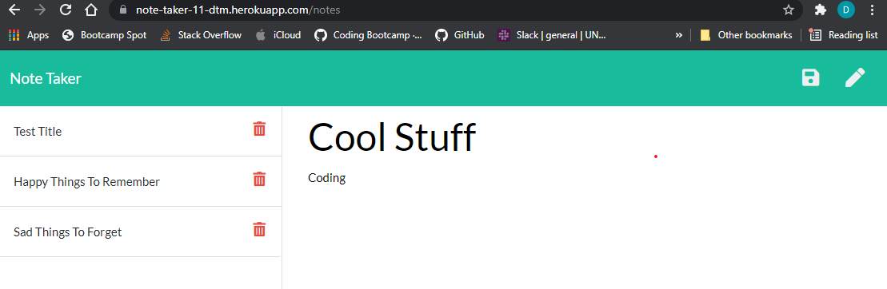

## Project Headline: Note Taking In The Wild   
    Table of Contents:  
[Project Why](#why) 
[Project Designers Contact/Github](#contact)   
    
    
## Why, What and How, Installation, Usage, Contributors, and Testing
#### (why)
  
Project Why: The evolution of my learning has attained the level of using  node and express to release into the server realm.
 
Project What: This is my first effort at releasing beyond local through Heroku.
 
Project How: As previously mentioned, through node/express and Heroku.
 
Installation Instructions:  Go to the site: https://note-taker-11-dtm.herokuapp.com/
 
Usage Information: Feel free to visit my GitHub repo:   https://github.com/dtmerrill/note-taker    Also, go to the app itself: https://note-taker-11-dtm.herokuapp.com/
 

 
Guidelines for Contributions to this Project:  No restrictions.
 
Relevant Tests: N/A
 
 
## Contact, Github, Email, License
#### (contact information)
 
Questions Regarding this Project and/or its Usage: Email
 
Project License: MIT
 
Email Project Designer: [dtmerrilliii@gmail.com](dtmerrilliii@gmail.com/)
 
Designers Github Page: https://github.com/dtmerrill 